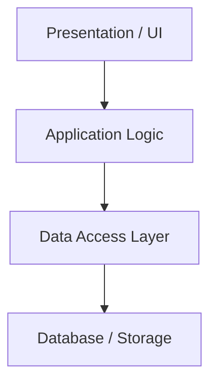
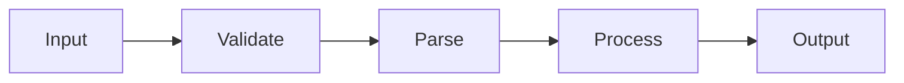

# Lecture 15: Software Architecture (Beyond MVC)

## Introduction

As software systems grow, developers can no longer think only in terms of individual functions, files, or classes. They also need a way to reason about the larger structure of the system: which parts exist, what responsibilities they hold, how they interact, and what kinds of change the structure makes easier or harder. This is the domain of software architecture.

SWEBOK treats software architecture as a major engineering concern because architecture shapes the system long before many detailed implementation choices are made. The Lecture 15 reading set also points in this direction through the software architecture and architectural pattern articles, along with the comparison between monolithic and microservice styles. Head First Software Development is also useful here, especially its chapter on good-enough design and its appendix material on UML and refactoring, because those help students think about structure, responsibilities, and how to communicate architecture visually. The central idea is that architecture is about organizing a software system so it can meet technical and business constraints over time.

This chapter focuses on three core ideas:

- Architectural styles
- Tradeoffs and constraints
- Architecture versus design

These topics matter because structure is never neutral. The way a system is organized affects maintainability, testing, deployment, scaling, coupling, and the cost of future change.

## 1. What Software Architecture Means

Students often use the word "architecture" loosely to mean any kind of structure. In software engineering, software architecture refers to the high-level organization of a system: its major parts, the relationships among those parts, and the key decisions that shape the whole.

This view is consistent with the software architecture reading. Architecture is not merely decoration or documentation. It is the set of structural choices that determine how the system behaves as a whole.

Architecture typically addresses questions like:

- What are the major components of the system?
- How do components communicate?
- Where are responsibilities located?
- What is centralized and what is separated?
- What constraints shape future implementation choices?

In a course project, architecture may still be small, but it is still present. Even a simple Python or JavaScript project makes architectural choices, whether explicitly or accidentally.

## 2. Architecture Versus Design

One of the recurring confusions in software engineering is the distinction between architecture and design.

A useful rule of thumb is:

- Architecture concerns the major structural decisions of the system
- Design concerns more local decisions inside that structure

For example:

- Choosing a layered system with frontend, application logic, and persistence is an architectural choice
- Choosing how to implement a parser helper function is a design choice
- Deciding that deployment logic belongs in GitHub Actions rather than inside the application code is architectural
- Choosing variable names and function boundaries within one module is design

The difference is partly scale and partly consequence. Architectural decisions tend to constrain many later design decisions.

This does not mean architecture is always made first in a neat sequence. In real projects, architectural and design decisions often influence each other. But the distinction is still useful because it helps teams identify which choices are broad structural commitments and which are local implementation details.

## 3. MVC Is Not The Whole Story

Many students learn system structure through Model-View-Controller, especially in web development. MVC is useful, but it is only one architectural pattern and not a universal answer.

In this course, recommending MVC as a clean default has been reasonable. It gives students a practical way to separate user interface concerns, application logic, and data-related responsibilities. That separation is often enough to prevent simple projects from collapsing into one tangled file.

Lecture 15 is "Beyond MVC" because software systems can be organized in many other ways depending on their goals and constraints. The point is not to replace MVC as a teaching tool, but to show that MVC sits inside a larger architectural landscape.

For example:

- A static site plus JavaScript interactions may not really be an MVC system
- A Python API with separate frontend and backend concerns may fit a layered model better than a classic MVC one
- A collection of separately deployable services may fit a microservices style

The point is not that MVC is wrong. The point is that architecture should be chosen because it fits the problem, not because it is the first pattern a developer learned.

Here is a simple MVC-style view of structure:

## 4. Architectural Styles

An architectural style is a recurring way of organizing software. The architectural pattern reading is useful here because it explains that systems often share high-level structural forms even when the implementation details differ.

Lecture 15 emphasizes three common styles:

- Layered architecture
- Client-server architecture
- Microservices architecture

These are not the only possible styles, but they are common enough to help students reason about real systems.

In practice, systems often combine styles. A course project might be:

- architecturally client-server at the system level
- organized internally with MVC or layers
- using workflow stages for a specific operational process

## 5. Layered Architecture

In a layered system, responsibilities are separated into layers, and each layer typically depends on the services of the layer below it.

A simple layered example might include:

- Presentation layer
- Application or business logic layer
- Data access layer
- Persistence layer

For course projects, a lightweight version might look like:

- browser UI in HTML/CSS/JavaScript
- Python application logic in route handlers and helpers
- file-based or database-backed storage

The strengths of layering include:

- clearer separation of responsibility
- easier reasoning about change boundaries
- improved testability when layers are not tightly tangled

The weaknesses include:

- extra indirection
- risk of "leaky layers" when code bypasses intended boundaries
- overhead that may be excessive in very small systems

Layered architecture is often a strong fit for systems that need clarity, maintainability, and incremental growth.

This kind of partitioning is useful because it keeps complexity away from modules that do not need to know it. A database access layer is a good example. If storage details stay in one area, the rest of the system can work with cleaner abstractions instead of knowing SQL queries, file formats, or connection details.

A simple layered view might look like this:

## 6. Client-Server Architecture

In client-server architecture, one part of the system requests services and another provides them.

Typical examples include:

- a browser calling a Python server
- JavaScript fetching JSON from an API
- a mobile client talking to a backend service

This style is extremely common because it maps naturally onto networked applications.

In course terms:

- the client may be the browser running `index.html` and `sketch.js`
- the server may be a Python app or a static file server on Linux

The strengths include:

- clear network boundary
- possibility of independent client and server evolution
- straightforward deployment models

The weaknesses include:

- network latency and failure concerns
- duplicated assumptions between client and server
- contract management problems when request and response formats change

Client-server architecture becomes especially important when discussing impact analysis, because contract changes can propagate across the client-server boundary in surprising ways.

It also helps divide work across a team. One developer or subteam may work primarily on frontend behavior while another works on backend services, provided the interface between them is clear and stable enough.

## 7. Monolith And Microservices

The microservices and monolithic application readings are useful as a pair because they frame a major architectural tradeoff.

A monolithic system is one application deployed as one unit. That does not necessarily mean it is badly designed. A monolith can still be cleanly structured internally.

A microservices system separates functionality into multiple services that communicate over well-defined interfaces.

### Monolithic Strengths

- simpler deployment
- simpler local development
- easier debugging in small systems
- fewer distributed-system concerns

### Monolithic Weaknesses

- scaling the whole system together
- risk of tight coupling inside one codebase
- harder team separation if the system becomes very large

### Microservices Strengths

- service-level separation of concerns
- independent deployment possibilities
- technology flexibility across services

### Microservices Weaknesses

- distributed-system complexity
- network and observability overhead
- harder testing across service boundaries
- more operational burden

For many course projects, a monolith or lightly layered client-server system is the more realistic architecture. Microservices are worth understanding, but not worth imitating casually.

That caution matters because architectural complexity is itself a cost. A project should not split into services merely to look advanced.

## 8. Constraints Shape Architecture

Architecture is always shaped by constraints.

Common constraints include:

- team size
- timeline
- budget
- deployment environment
- performance needs
- reliability requirements
- security requirements
- existing tools and infrastructure

This is why there is no universally best architecture. The right architecture for one system may be wasteful or dangerous for another.

For example:

- A small class project may be better served by one repository and one deployable unit
- A large organization with many teams may need stronger service boundaries
- A system deployed on one Linux host has different architectural pressures than one running across multiple cloud environments

SWEBOK's engineering perspective matters here: architecture is not style for style's sake. It is design under constraint.

Team organization is also a constraint. Architecture can help divide work among people so that several modules can move forward at once without every developer needing to know the internals of every other module.

## 9. Tradeoffs In Architecture

Architecture is a tradeoff discipline. Every structural decision helps some goals and hurts others.

Examples:

- Strong separation may improve maintainability but add implementation overhead
- A monolith may simplify development but make future scaling harder
- Microservices may improve service isolation but dramatically increase operational complexity
- Shared data models may speed development but increase coupling

A useful architectural mindset is to ask:

- What problem is this structure solving?
- What cost does it introduce?
- What kinds of future change does it make easier?
- What kinds of future change does it make harder?

Without those questions, teams often choose architecture by fashion rather than by fit.

Other architectural advantages also matter:

- easier onboarding when responsibilities are clearly located
- clearer ownership of modules or services
- more focused testing strategies
- reduced blast radius from some bug fixes and feature changes
- better long-term maintainability when change stays inside boundaries

## 10. Architecture In Course Projects

Course projects are small enough that architecture may feel invisible, but it is still there.

Examples:

- A parser module separated from tests is an architectural boundary, even if small
- A deployment workflow stored in `.github/workflows/` rather than inside app code is an architectural separation of concerns
- A frontend in `index.html` and `sketch.js` talking to a Python backend is a client-server structure
- A project that mixes UI, parsing, deployment logic, and persistence in one file has weak architecture even if it still runs

These examples matter because architecture is not reserved for "big systems." It appears whenever a team decides how responsibilities are organized.

Workflow-oriented systems provide another useful example. Sometimes the cleanest structure is not MVC first, but a series of workflow stages where each stage does one job and hands work to the next.

That pattern can be useful when the important architecture is a pipeline of operations rather than a user-interface-centered separation.

## 11. Architecture And Maintainability

Architecture has a direct effect on maintenance.

A system with clear boundaries is usually easier to:

- test
- refactor
- reason about
- deploy
- change safely

A system with weak boundaries often produces:

- hidden coupling
- unclear ownership
- broader impact from local changes
- more regressions during maintenance

This connects Lecture 15 back to Lecture 14. When maintenance becomes difficult, the root cause is often architectural rather than merely local coding style.

This is also where the Single Responsibility Principle becomes important. SRP is often taught as a design principle, but it has architectural consequences. If modules have one clear responsibility, then:

- testing becomes easier because the module has a clearer contract
- ownership becomes easier because the module has a clearer purpose
- maintenance becomes easier because changes are more localized
- impact analysis becomes easier because the boundaries are clearer

## 12. Architecture And Impact Analysis

Architecture determines how change propagates.

If a system has well-defined boundaries, impact analysis becomes easier because the team can ask:

- Which layer is affected?
- Which interfaces are crossed?
- Which clients depend on this service?
- Which modules consume this data contract?

If the architecture is tangled, impact analysis becomes much harder because the team cannot clearly see where changes begin or end.

For example:

- In a layered system, a UI change may stay mostly in the presentation layer
- In a badly entangled system, the same UI change may force edits throughout the codebase
- In a client-server system, changing a JSON response shape may affect both server code and client code

So architecture is not just a static description of the system. It actively shapes maintenance cost and regression risk.

This is why good architecture can reduce the impact of bug fixes and feature additions. The architecture does not eliminate impact, but it can limit the scope of what has to be considered before making a change.

## 13. When Architecture Is Too Much

Students sometimes overcorrect after learning architectural styles and begin inventing complexity for its own sake.

Architecture becomes counterproductive when:

- the structure is more complicated than the problem requires
- layers exist only on paper and are constantly bypassed
- services are split before there is a real need
- the team spends more time preserving abstractions than solving user problems

Good architecture is not maximal structure. It is appropriate structure.

It is also often discovered rather than perfectly predicted. Teams do not always know the best structure at the beginning. Sometimes good architecture emerges as repeated pain points reveal better boundaries.

For a small course project, this usually means:

- clearer separation of concerns
- reasonable module boundaries
- a simple deployment model
- enough structure to support change, but not so much that the project becomes ceremony-heavy

Refactoring is often the right time to implement these better structural choices. If regression tests are in place, the team can safely reshape the architecture without losing confidence in user-visible behavior.

## 14. Practical Guidance

For a small or medium project, a reasonable architectural baseline is:

- Identify the major parts of the system
- Give each part a clear responsibility
- Keep interfaces explicit
- Avoid unnecessary cross-layer coupling
- Choose a style that matches actual constraints
- Revisit the architecture when maintenance pain reveals structural problems

For this course, those habits can be translated into concrete behavior:

- If the frontend and backend have different responsibilities, keep them separate
- If parsing logic is reused, keep it out of UI code
- If deployment logic is operational rather than application logic, keep it in workflows and scripts
- If changes regularly ripple everywhere, treat that as an architectural warning sign
- If one module has too many reasons to change, split its responsibilities
- If a workflow naturally breaks into stages, consider making those stages explicit
- Use diagrams when the structure is hard to describe clearly in prose

These habits make later maintenance, testing, and deployment much easier.

## Summary

Software architecture is the high-level organization of a system: its major parts, relationships, and structural commitments. The Lecture 15 readings support this from complementary angles:

- the software architecture reading explains why high-level structure matters
- the architectural pattern reading shows that systems often reuse recurring structural forms
- the monolithic application and microservices readings clarify a major tradeoff in modern systems
- Head First Software Development Chapter 5 reinforces the relationship between design quality, structure, and maintainability
- Head First Software Development Appendix A provides useful supporting notation and concepts such as UML class diagrams, sequence diagrams, and refactoring

If a team can identify its architectural style, explain the constraints shaping it, and distinguish broad structural choices from local design decisions, then it is reasoning about software at the right level.

## Discussion Questions

1. What is the difference between architecture and design?
2. Why is MVC only one possible architectural pattern rather than a universal default?
3. When is a layered architecture useful, and when is it too much?
4. What tradeoffs separate monolithic and microservices systems?
5. How does architecture affect maintenance cost and impact analysis?

## References

- SWEBOK v4 summary and source listing in this repository: `SWEBOK/swebok-outline.md`
- SWEBOK full PDF: https://ieeecs-media.computer.org/media/education/swebok/swebok-v4.pdf
- Head First Software Development, Chapter 5: Good-Enough Design: Getting it done with great design
- Head First Software Development, Appendix A: Leftovers: The top 5 topics (we didn’t cover)
  - UML class diagrams
  - Sequence diagrams
  - Refactoring
- Wikipedia: Software Architecture
  https://en.wikipedia.org/wiki/Software_architecture
- Wikipedia: Architectural Pattern
  https://en.wikipedia.org/wiki/Architectural_pattern
- Wikipedia: Monolithic Application
  https://en.wikipedia.org/wiki/Monolithic_application
- Wikipedia: Microservices
  https://en.wikipedia.org/wiki/Microservices
