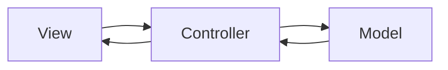
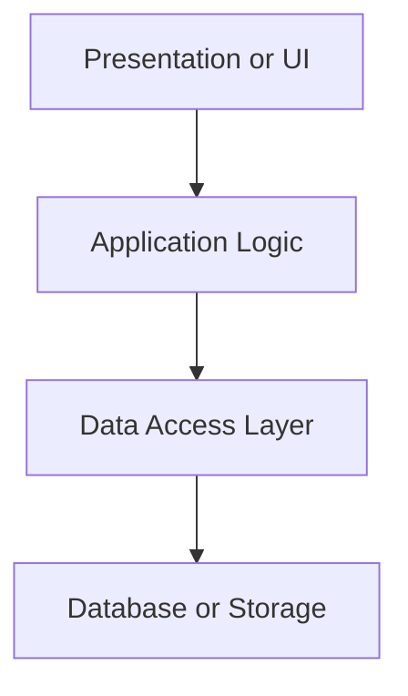
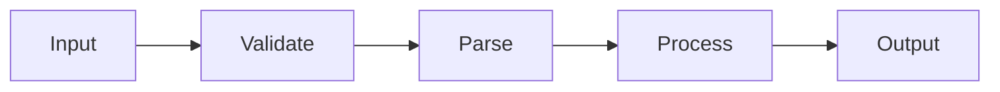

# Lecture 15

Software Architecture (Beyond MVC)

---

## Lecture Focus

- architectural styles
- tradeoffs and constraints
- architecture versus design
- architecture for teamwork and maintenance
- architecture as a tool for limiting change impact

---

## Reading Selections

Lecture 15 readings:

- SWEBOK: Software Architecture
- Wikipedia: software architecture
- Wikipedia: architectural pattern
- Wikipedia: monolithic application
- Wikipedia: microservices
- Head First Software Development: Chapter 5 and Appendix A on UML, sequence diagrams, and refactoring

---

## Why This Matters

Architecture affects:

- how teams divide work
- how code gets tested
- how changes spread
- how systems are deployed
- how expensive maintenance becomes

---

## What Architecture Means

Software architecture is the high-level organization of a system.

It asks:

- what major parts exist?
- how do they connect?
- where do responsibilities live?

---

## Architecture Is Structural

Architecture is not decoration.

It is a set of structural choices that shape:

- implementation
- testing
- deployment
- future change

---

## Architecture Versus Design

- architecture: major structural decisions
- design: more local decisions inside that structure

Both matter, but they operate at different scales.

---

## Architecture Example

Architectural choices:

- layered application
- client-server split
- deployment in GitHub Actions
- separate parser and UI modules

---

## Design Example

Design choices:

- helper function boundaries
- variable naming
- parser implementation details
- one module's internal class structure

---

## MVC Is A Useful Default

In this course, MVC has been a reasonable clean default.

Why:

- separates UI concerns
- separates application logic
- separates data-related responsibilities

---

## MVC Is Not Universal

MVC is one pattern, not the whole field.

Some systems fit better as:

- layered systems
- workflow pipelines
- client-server systems
- service-oriented systems

---

## MVC Diagram

---

## Architectural Styles

Lecture 15 emphasizes:

- layered architecture
- client-server architecture
- monolithic structure
- microservices structure

---

## Styles Can Combine

Real systems often mix styles.

Example:

- client-server at the system level
- layered or MVC internally
- workflow stages inside one process

---

## Layered Architecture

Layers separate kinds of responsibility.

Typical layers:

- presentation
- application logic
- data access
- storage

---

## Why Layers Help

Layering can improve:

- separation of concerns
- testability
- maintainability
- impact analysis

---

## Database Access Layer

A data access layer keeps storage details in one place.

That means other modules do not need to know:

- SQL details
- file formats
- connection behavior
- storage-specific error handling

---

## Layered Diagram

---

## Layered Tradeoffs

Strengths:

- cleaner boundaries
- easier testing
- easier change control

Costs:

- extra indirection
- risk of bypassing layers
- overhead for very small systems

---

## Client-Server Architecture

In client-server architecture:

- one part requests services
- another part provides them

This is common in browser-based software.

---

## Course Client-Server Example

- browser runs `index.html` and `sketch.js`
- Python server provides routes or files
- Linux host runs the deployed service

That is already a meaningful architectural split.

---

## Client-Server Strengths

- clear network boundary
- frontend and backend can evolve separately
- deployment responsibilities are easier to reason about

---

## Client-Server Risks

- network failure and latency
- mismatched assumptions
- contract drift between client and server

JSON shape changes are a common example.

---

## Monolith

A monolith is one application deployed as one unit.

That does not automatically mean bad design.

A monolith can still be:

- modular
- layered
- maintainable

---

## Why Monoliths Persist

Monoliths often win for smaller systems because they offer:

- simpler deployment
- simpler local development
- easier debugging
- fewer distributed-system problems

---

## Microservices

Microservices split functionality into separately communicating services.

Potential advantages:

- service-level separation
- independent deployment
- technology flexibility

---

## Microservices Costs

Microservices also create:

- distributed-system complexity
- network overhead
- harder cross-service testing
- more operational burden

---

## Course-Sized Advice

For most course projects:

- monolith or light client-server is realistic
- microservices are usually too much

Advanced-looking structure is not automatically better architecture.

---

## Constraints Shape Architecture

Architecture is always shaped by constraints:

- team size
- time
- deployment environment
- reliability needs
- existing tools

---

## Architecture Is Tradeoff Work

A useful architectural question set:

- what problem does this structure solve?
- what cost does it introduce?
- what future change becomes easier?
- what future change becomes harder?

---

## Architecture Helps Teams

Good architecture can let team members work in parallel.

That works when:

- module boundaries are clear
- interfaces are explicit
- internals stay hidden

---

## Single Responsibility Matters

SRP is not only a local design rule.

It also helps architecture by making modules:

- easier to own
- easier to test
- easier to change

---

## Architecture Helps Testing

Clear structure improves testing because:

- boundaries are easier to isolate
- contracts are easier to define
- dependencies are easier to replace

SRP helps here too.

---

## Workflow Stages As Architecture

Some systems are best understood as stages rather than MVC pieces.

This is useful when the main concern is processing flow.

Examples:

- validation
- parsing
- transformation
- output

---

## Workflow Diagram

---

## Architecture And Maintenance

Clear architecture usually makes systems easier to:

- test
- refactor
- deploy
- reason about
- maintain over time

---

## Architecture And Impact Analysis

Architecture shapes how change propagates.

Questions become easier when boundaries are clear:

- which layer is affected?
- which interface is crossed?
- which client depends on this contract?

---

## Limiting Change Impact

Good architecture does not eliminate impact.

It can reduce the blast radius by keeping changes inside:

- one layer
- one workflow stage
- one service
- one clear module boundary

---

## Poor Architecture Warning Signs

- UI and storage logic mixed together
- one file has too many reasons to change
- changes ripple everywhere
- ownership is unclear
- tests are hard to isolate

---

## Architecture Can Emerge

Teams do not always discover the best structure on day one.

Sometimes better architecture emerges when:

- pain points repeat
- boundaries become clearer
- refactoring reveals a simpler structure

---

## Refactoring Supports Architecture

Refactoring is often the right time to improve structure.

That is safer when regression tests already exist.

Architecture and maintenance are closely connected.

---

## Practical Baseline

For course projects:

- identify the major parts
- give each part a clear job
- keep interfaces explicit
- avoid unnecessary complexity
- revisit structure when maintenance pain appears

---

## Diagramming Helps

Diagrams are useful when prose is not enough.

Helpful options:

- MVC diagrams
- layered diagrams
- workflow diagrams
- sequence diagrams

Mermaid is often enough for this work.

---

## Reading Map

Head First Software Development supports this lecture:

- Chapter 5: good-enough design and maintainability
- Appendix A: UML class diagrams
- Appendix A: sequence diagrams
- Appendix A: refactoring

---

## Takeaway

Architecture is the system-level organization of software.

A good architecture:

- fits the actual problem
- respects constraints
- supports teamwork
- improves testing and maintenance
- limits the scope of change
