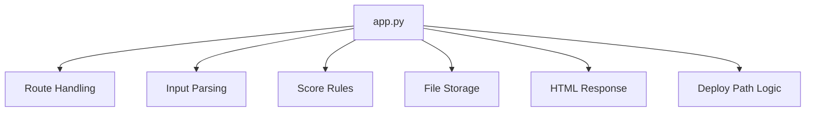
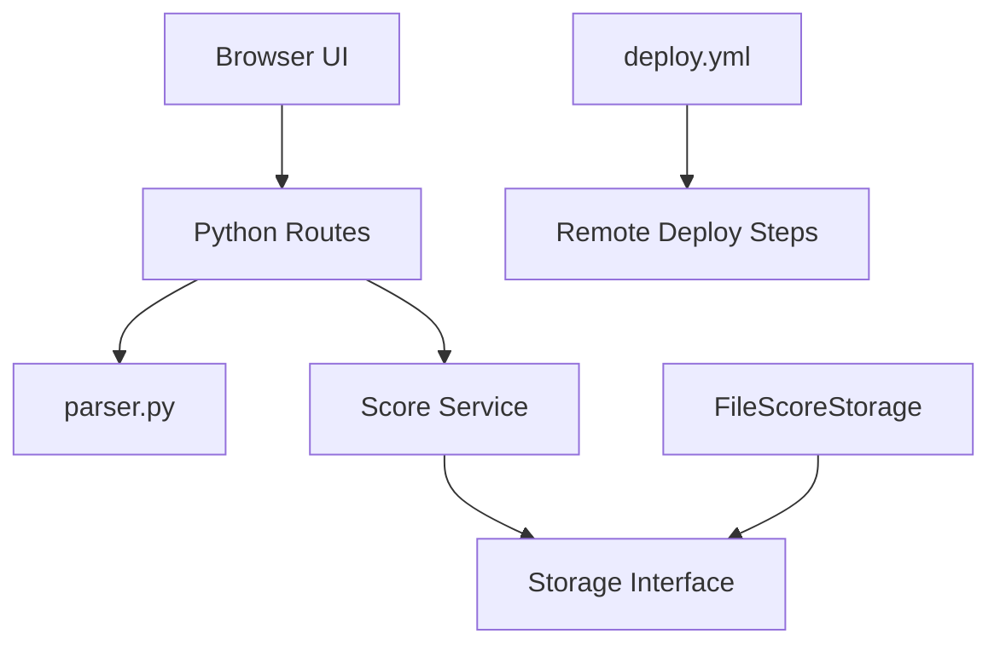
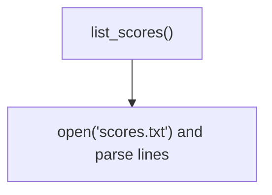
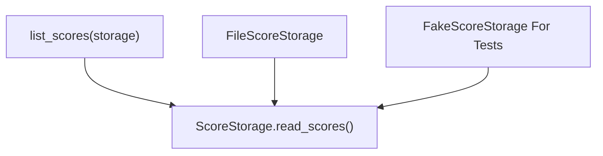
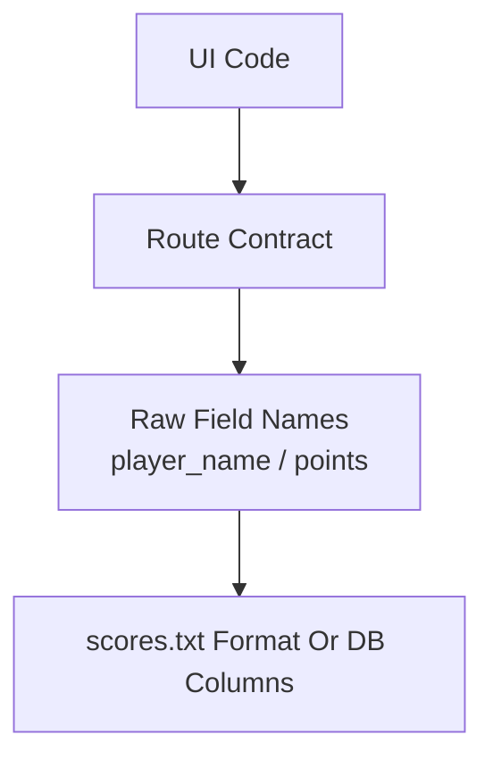
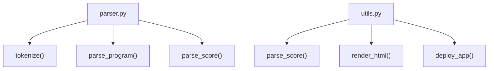
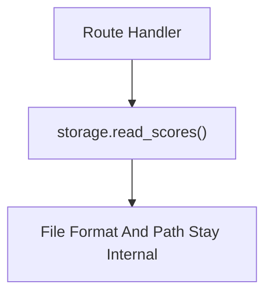

# Lecture 16

Design Principles (SOLID and Modularity)

---

## Focus

- the five SOLID principles
- coupling and cohesion
- interface boundaries
- modularity for testing and maintenance


---

## Why This Matters

Design principles affect:

- change cost
- testing effort
- regression risk
- team coordination
- long-term maintainability

---

## The Point

Bad design usually does not fail all at once.

It gets worse a little at a time. One file picks up another job. One module starts knowing too much. Then small changes start causing trouble in places they should not.

---

## Design Principles

Design principles are practical rules for structuring code.

They help answer:

- what belongs together?
- what should be separated?
- what should other modules know?

---

## Bad Modularity Example



One module knows too many unrelated things.

---

## Better Modularity Example



Responsibilities are separated by concern and boundary.

---

## Design Versus Architecture

- architecture: larger system structure
- design: structure inside those larger choices

Lecture 15 and Lecture 16 are connected, but they are not the same topic.

---

## Core Questions

- does this module have one coherent job?
- does extension require risky rewrites?
- can implementations be safely substituted?
- are interfaces too broad?
- does high-level logic depend on low-level details?
- how dependent is it on other modules?
- do its contents belong together?
- is its interface too wide or too leaky?

---

## What SOLID Means

`SOLID` stands for:

- Single Responsibility
- Open-Closed
- Liskov Substitution
- Interface Segregation
- Dependency Inversion

---

## SOLID In Plain Terms

- focused responsibilities
- safer extension
- substitutions you can trust
- smaller interfaces
- abstractions over details

---

## Single Responsibility Principle

SRP:

- a module should have one reason to change

This is about coherent responsibility, not tiny size.

---

## SRP Is Often Misread

SRP does not mean:

- one line per file
- one function per module
- endless wrappers

The question is whether the responsibilities belong together.

---

## SRP Example

Reasonable:

- `parser.py` handles parsing concerns
- a data access module handles storage concerns
- `deploy.yml` handles deployment concerns

---

## SRP Violation Example

One file that:

- validates input
- updates storage
- renders HTML
- logs deployment details

is probably carrying too many responsibilities.

---

## SRP Code Example

```python
def save_score(request, path):
    name = request.form["name"].strip()
    score = int(request.form["score"])
    with open(path, "a", encoding="utf-8") as handle:
        handle.write(f"{name},{score}\n")
    return f"<p>Saved {name}</p>"
```

Too many jobs in one place.

---

## SRP Better Version

```python
def parse_score(form):
    return form["name"].strip(), int(form["score"])

def append_score(path, name, score):
    ...
```

Separate concerns are easier to test and change.

---

## Why SRP Helps

SRP improves:

- readability
- maintainability
- impact analysis
- ownership clarity
- testability

---

## SRP And Testing

Focused modules are easier to test because:

- setup is smaller
- failures are easier to interpret
- tests target one concern more precisely

---

## Open-Closed Principle

OCP:

- open for extension
- closed for risky modification of working code

Add new cases without rewriting the fragile center.

---

## Why OCP Matters

OCP matters when a team keeps reopening the same code for every new case.

That usually means one new feature also means one more chance to break an old one.

---

## OCP Problem Example

```python
def format_score(score, mode):
    if mode == "text": ...
    if mode == "json": ...
    if mode == "csv": ...
```

Every new mode edits the same function.

---

## Another OCP Problem

```python
def apply_move(game, move_type, payload):
    if move_type == "jump": ...
    elif move_type == "duck": ...
    elif move_type == "slide": ...
```

Every new move reopens the dispatcher.

---

## OCP Better Direction

```python
FORMATTERS = {"text": text_fmt, "json": json_fmt}
def format_score(score, mode):
    return FORMATTERS[mode](score)
```

New behavior can be added with less risk to existing code.

---

## Another OCP Better Direction

```python
MOVE_HANDLERS = {"jump": jump_move, "duck": duck_move}
def apply_move(game, move_type, payload):
    return MOVE_HANDLERS[move_type](game, payload)
```

Variation is added by registration, not surgery.

---

## OCP Judgment

OCP does not mean:

- endless abstraction
- plugin systems for tiny code
- avoiding all conditionals

Use it when new variations keep arriving.

---

## Liskov Substitution Principle

LSP:

- a replacement should behave like a valid replacement

If callers rely on a contract, substitutes must preserve that contract.

---

## LSP Problem Example

```python
class BrokenScoreStorage:
    def read_scores(self):
        return None
```

If callers expect a score list, this is not a safe substitute.

---

## LSP Example

If `list_scores(storage)` expects `storage.read_scores()`,

then different storage implementations should all:

- return compatible score data
- fail in compatible ways
- avoid surprising callers

---

## LSP Better Example

```python
class MemoryScoreStorage:
    def read_scores(self):
        return [["Ada", "7"], ["Linus", "5"]]
```

Different implementation, same usable contract.

---

## Why LSP Matters

Abstraction only helps when substitution is safe.

Otherwise:

- callers become defensive
- tests become messy
- interfaces stop meaning much

---

## Interface Segregation Principle

ISP:

- clients should not depend on methods they do not use

Oversized interfaces usually hide mixed concerns.

---

## Why ISP Matters

When interfaces are too wide:

- clients import too much
- responsibilities blur
- modules become harder to understand

---

## ISP Problem Example

```python
class AppServices:
    def read_scores(self): ...
    def deploy_to_server(self): ...
    def render_score_html(self): ...
```

Most clients do not need all of that.

---

## ISP Better Example

```python
class ScoreReader:
    def read_scores(self): ...

class ScoreRenderer:
    def render_score_html(self, scores): ...
```

Clients can depend on the part they actually use.

---

## ISP Better Direction

Split large interfaces by concern:

- score reading
- score writing
- rendering
- deployment

Smaller interfaces produce cleaner dependencies.

---

## Dependency Inversion Principle

DIP:

- high-level logic should depend on abstractions
- not directly on low-level details

---

## What Gets Inverted

The inversion is the dependency direction.

Bad direction:

- high-level logic -> low-level detail

Better direction:

- high-level logic -> abstraction
- low-level detail -> abstraction

---

## Before DIP



Policy depends directly on mechanism.

---

## After DIP



Now both policy and mechanism depend on the interface.

---

## Why DIP Matters

Without DIP:

- high-level logic gets tied to storage or network details
- testing gets harder
- replacements require broader rewrites

---

## DIP Problem Example

```python
def list_scores():
    with open("scores.txt", encoding="utf-8") as handle:
        ...
```

Application logic is tied directly to file details.

---

## DIP Better Example

```python
class FileScoreStorage:
    def read_scores(self):
        ...

list_scores(FileScoreStorage())
```

The high-level function depends on a capability, not a file path.

---

## DIP Better Direction

```python
def list_scores(storage):
    return storage.read_scores()
```

Now the same logic can use files, databases, or test doubles.

---

## Coupling

Coupling is the degree of dependency between modules.

High coupling means one part knows too much about another part's details.

---

## Coupling Diagram



High coupling often means the wrong details are crossing boundaries.

---

## High Coupling Looks Like

- UI code knows storage layout
- many files depend on exact JSON field details
- one module reaches into another module's internals
- several files duplicate the same low-level assumptions

---

## Why High Coupling Hurts

High coupling causes:

- broader change ripple
- harder testing
- weaker module replacement
- more fragile maintenance

---

## Low Coupling

Low coupling means depending on stable interfaces rather than hidden internals.

Modules still cooperate.

They just cooperate more safely.

---

## Low Coupling Example

- frontend calls a stable JSON API
- parser callers use parse functions, not parser internals
- app logic uses a data access layer, not raw storage details

---

## Python Boundary Example

```python
def load_scores(storage):
    rows = storage.read_scores()
    return [{"name": row["player_name"], "score": row["points"]} for row in rows]
```

Translate raw storage data once.

---

## Cohesion

Cohesion is the degree to which the contents of one module belong together.

High cohesion:

- focused purpose
- understandable contents
- related responsibilities

---

## Low Cohesion

Low cohesion means a module is a grab bag.

Classic warning sign:

- a `utils.py` file full of unrelated helpers

---

## Cohesion Example

High cohesion:

- a parser module with parsing helpers
- a deployment workflow with deployment steps

Low cohesion:

- one file mixing parsing, HTML formatting, storage, and deployment logic

---

## Cohesion Diagram



---

## Coupling And Cohesion Together

Good modular design often aims for:

- low coupling
- high cohesion

Bad modular design often has the opposite pattern.

---

## Interface Boundaries

An interface boundary defines:

- what a module exposes
- what remains internal

This is how a module limits what others can rely on.

---

## Interface Boundary Diagram



---

## Good Boundaries Help

Strong interface boundaries make:

- refactoring safer
- testing easier
- responsibilities clearer
- dependency control stronger

---

## Weak Boundaries Hurt

Weak boundaries mean:

- callers depend on internals
- changes propagate farther
- tests become brittle
- ownership gets blurry

---

## Python Example

A good Python boundary might be:

- `parser.py` exports parse functions
- callers do not manipulate parser internals directly
- storage helpers hide file or database details

---

## Python Interface Example

```python
def load_scores(storage):
    return storage.read_scores()
```

The caller depends on an interface, not file details.

---

## Another Python Example

A good Python boundary might be:

- one storage module for score access
- one formatter module for score output
- one route layer for request handling

---

## Teamwork

Modularity helps teams divide work.

If boundaries are clear:

- one person can work on UI
- one can work on storage
- one can work on workflows

without constant conflict.

---

## Design And Pull Requests

A small change that touches many unrelated files is often a design warning sign.

It may indicate:

- high coupling
- weak boundaries
- mixed responsibilities

---

## Design And Maintenance

Lecture 16 connects directly to Lecture 14.

Good design makes:

- bug fixes more local
- refactoring safer
- impact analysis easier
- regressions less likely

---

## Design And TDD

TDD works better when:

- units are focused
- interfaces are clear
- dependencies are manageable

Testing and modular design reinforce each other.

---

## Test Example

```python
def test_parse_score():
    form = {"name": "Ada", "score": "7"}
    assert parse_score(form) == ("Ada", 7)
```

Small responsibilities produce smaller tests.

---

## Refactoring Toward Better Design

Refactoring is often needed when:

- one file has too many reasons to change
- tests need too much setup
- changes ripple everywhere
- developers duplicate code to avoid existing modules

---

## Practical Baseline

For course projects:

- keep modules focused
- separate UI from persistence
- keep deployment logic out of app logic
- prefer stable interfaces
- treat ripple effects as design warnings

---

## Course Examples

- keep parsing logic in `parser.py`
- keep GitHub deployment logic in `.github/workflows/`
- keep `p5.js` drawing separate from storage access
- keep API request formatting separate from DOM updates

---

## Reading References

Lecture 16 readings:

- SWEBOK: Software Design
- Wikipedia: SOLID
  URL: https://en.wikipedia.org/wiki/SOLID
- Wikipedia: Coupling (Computer Programming)
  URL: https://en.wikipedia.org/wiki/Coupling_(computer_programming)
- Wikipedia: Cohesion (Computer Science)
  URL: https://en.wikipedia.org/wiki/Cohesion_(computer_science)
- Head First Software Development: Chapter 5, Chapter 8, and Appendix A

Head First Software Development matters here mostly for design cleanup, TDD, diagrams, and refactoring.

---

## Takeaway

Lecture 16 is about designing modules that are:

- focused
- not overly dependent
- internally coherent
- protected by clearer boundaries

That is what makes modularity useful in practice.
