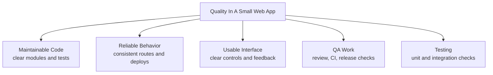
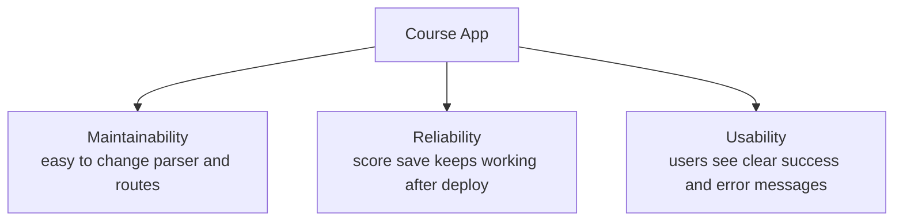
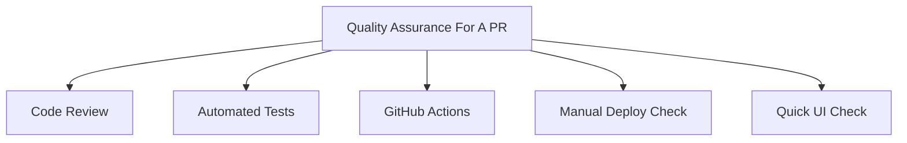
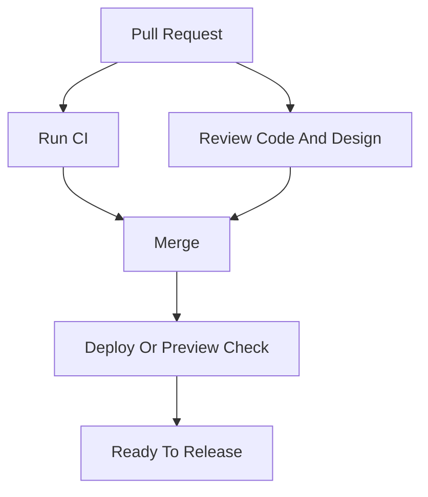
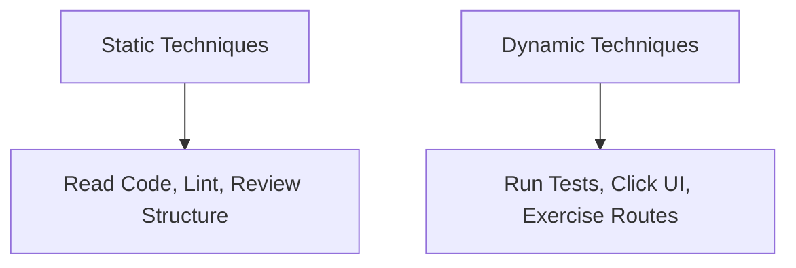
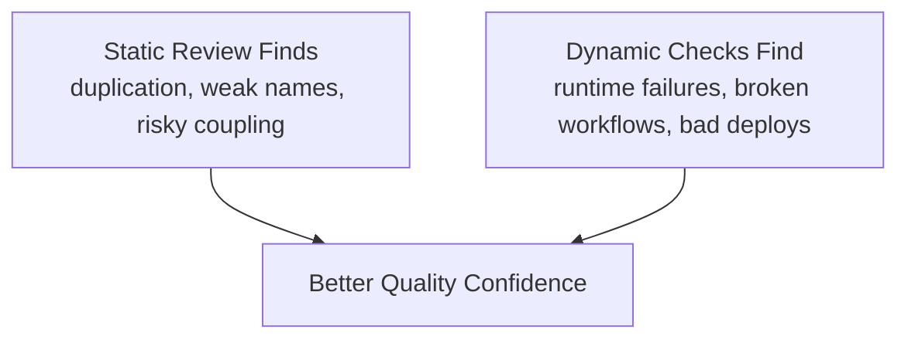

# Lecture 17

Software Quality (Beyond Testing)

---

## Focus

- quality attributes
- QA versus testing
- static versus dynamic techniques
- software quality beyond narrow correctness

---

## Why This Matters

Software can pass tests and still have poor quality.

Examples:

- hard to maintain
- unreliable in use
- confusing to users
- fragile to deploy

---

## The Point

Testing matters. It is just not the whole story.

A system can pass tests and still be hard to maintain, unreliable in use, confusing to users, or fragile to deploy.

---

## What Quality Means

Software quality is about meeting important expectations.

Different people care about different failures:

- users care whether the app makes sense
- developers care whether it can be changed safely
- operators care whether it stays up and deploys cleanly

---

## Quality Overview



---

## Quality Attributes

This lecture focuses on three attributes:

- maintainability
- reliability
- usability

---

## Attribute Diagram



---

## Maintainability

Maintainability asks:

- can we understand the code?
- can we fix it safely?
- can we extend it without chaos?

---

## Maintainability Example

- parser logic separated from routes
- storage separated from UI
- tests that protect important behavior

These all improve maintainability.

---

## Reliability

Reliability asks:

- does the system keep working correctly?
- does it behave consistently under expected use?

---

## Reliability Example

- a score route handles valid and invalid input consistently
- deployment serves the correct files after an update
- a game does not break after a small rules change

---

## Usability

Usability asks:

- can users understand the interface?
- can they complete tasks clearly?
- does the software behave predictably?

---

## Usability Example

- controls are labeled clearly
- errors are understandable
- success and failure produce visible feedback
- workflows do not confuse users

---

## Usability Code Example

```python
def submit_score(player, score):
    try:
        save_score(player, score)
    except ValueError as exc:
        return {"ok": False, "message": str(exc)}
    return {"ok": True, "message": f"Saved score for {player}"}
```

Visible feedback is part of software quality.

---

## Quality Tradeoffs

Quality attributes can compete.

Examples:

- more validation may improve reliability but add complexity
- more structure may improve maintainability but cost more time
- more flexibility may reduce usability

---

## QA Versus Testing

Testing is part of QA.

QA is broader than testing.

---

## QA Diagram



---

## Testing

Testing includes:

- unit tests
- integration tests
- end-to-end tests
- manual regression checks

---

## QA

QA also includes:

- review
- linting
- CI
- checklists
- deployment verification
- usability review

---

## Why The Distinction Matters

A team can run tests and still have:

- weak design
- confusing UI
- fragile deployment
- poor maintainability

---

## GitHub QA Flow



---

## Static Versus Dynamic

- static techniques inspect quality without ordinary execution
- dynamic techniques evaluate behavior through execution

Good engineering uses both.

---

## Static And Dynamic Diagram



---

## Static Techniques

- code review
- linting
- type checking
- static analysis
- design review
- reading workflow files for risk

---

## Dynamic Techniques

- running unit tests
- integration testing
- exploratory testing
- post-deploy verification
- runtime observation

---

## Static Review Example

```python
def load_scores(path):
    handle = open(path)
    return [line.strip() for line in handle]
```

A reviewer can spot issues before runtime:

- file handle never closes
- no error handling
- hidden resource leak

---

## Another Static Review Example

```python
def submit_score(player, score, storage):
    if player == "":
        print("Missing player")
    storage.write_score({"player": player, "score": score})
```

This also has visible quality problems before execution:

- weak error handling
- side effects mixed with response logic
- no clear caller-facing result
```

A reviewer can see quality problems before running it.

---

## Better Static Direction

```python
def submit_score(player, score, storage):
    if player.strip() == "":
        return {"ok": False, "error": "Missing player"}
    storage.write_score({"player": player, "score": score})
    return {"ok": True}
}
```

---

## Dynamic Example

```python
@app.post("/scores")
def add_score():
    data = request.get_json()
    save_score(data["player"], int(data["score"]))
    return {"ok": True}
```

Looks simple, but runtime use may still expose failures.

---

## Dynamic Concerns

Dynamic testing may reveal:

- missing keys
- invalid score values
- malformed JSON
- weak user-facing errors

---

## Dynamic Runtime Example

- a form appears to submit, but the screen never updates
- a deployment works once, then serves stale assets
- repeated use reveals a state bug

These are the kinds of failures static review will not fully settle.

These are runtime quality findings.

---

## Better Dynamic Direction

```python
data = request.get_json(silent=True) or {}
player = str(data.get("player", "")).strip()
```

Defensive handling improves reliability and response quality.

---

## Static And Dynamic Together

- review catches structural risk
- tests check behavior
- manual use reveals usability problems
- deployment verification catches release mistakes

---

## Combined Confidence



---

## GitHub-Centered Quality Work

Quality work can live in:

- pull requests
- GitHub Actions
- issue tracking
- deployment workflows
- release review

---

## Quality Beyond Correctness

Correct output is not enough.

A system may still be:

- hard to maintain
- unpleasant to use
- difficult to deploy safely
- fragile under change

---

## Practical Baseline

For course projects:

- test important behavior
- review code quality
- use CI where possible
- check usability directly
- verify deployed behavior

---

## Reading References

Lecture 17 readings:

- SWEBOK: Software Quality
- Wikipedia: Software Quality
  URL: https://en.wikipedia.org/wiki/Software_quality
- Wikipedia: ISO/IEC 25010
  URL: https://en.wikipedia.org/wiki/ISO/IEC_25010
- Wikipedia: Static Program Analysis
  URL: https://en.wikipedia.org/wiki/Static_program_analysis
- Head First Software Development: Chapters 7, 8, and 9

Head First Software Development matters here mostly for testing, CI, TDD, and iteration review.

---

## Takeaway

Software quality is broader than testing.

A disciplined team evaluates:

- structure
- behavior
- usability
- reliability
- release readiness
