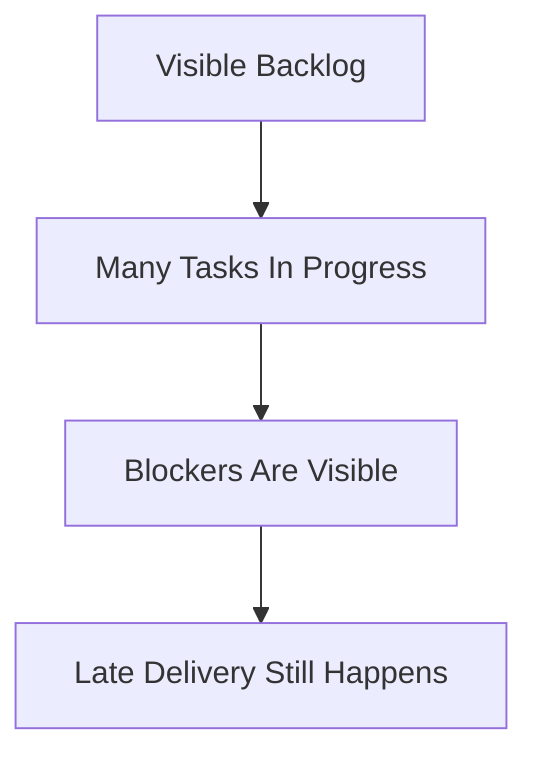
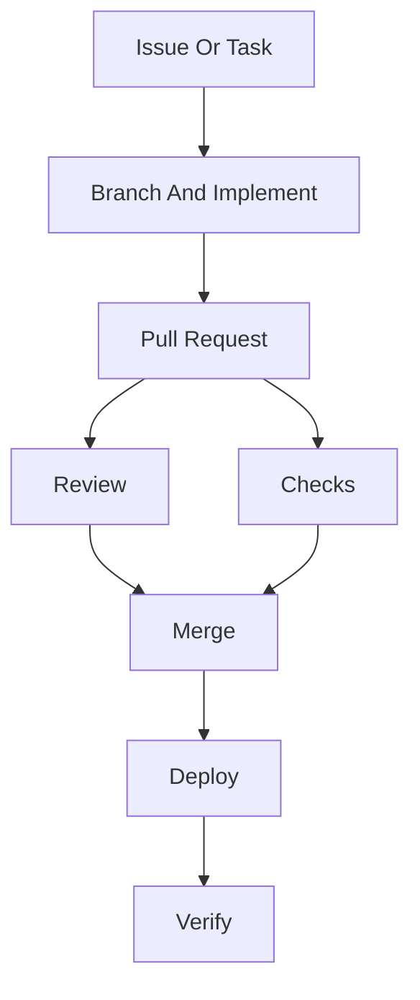

# Lecture 18

Process and Process Maturity (Beyond Scrum)

---

## Focus

- limits of Scrum
- process visibility versus control
- process maturity

---

## The Point

Teams always have a process.

The real question is whether that process is visible, deliberate, and good enough to support the work.

---

## Why This Matters

A weak process causes familiar problems:

- duplicate work
- hidden blockers
- sloppy reviews
- chaotic releases
- estimates that mean very little

---

## What Process Means

Software process is how work moves through the team.

That includes:

- choosing work
- implementing changes
- reviewing code
- testing
- releasing
- handling defects

---

## Even A Small Team Has A Process

A course project often follows a process like this:

1. pick a task
2. make a branch
3. implement the change
4. run checks
5. open a pull request
6. review and merge
7. deploy and verify

That is a process whether the team names it or not.

---

## Why Process Helps

Good process helps the team answer practical questions:

- what are we working on?
- what is blocked?
- what is done?
- what got reviewed?
- what got deployed?

---

## Scrum Is Useful

Scrum can help by giving teams:

- a visible backlog
- short planning cycles
- regular check-ins

Those are useful habits.

---

## Scrum Has Limits

Scrum does not automatically create:

- good design
- strong testing
- careful reviews
- reliable releases
- sane estimates

A sprint board is not the same thing as an engineering process.

---

## What Scrum Does Not Solve

A team can "use Scrum" and still:

- merge without review
- deploy by hand
- skip regression checks
- hide blockers until late
- move tickets around without improving delivery

---

## Visibility Versus Control

These are related, but not the same.

- visibility means the team can see what is happening
- control means the team can guide and stabilize what is happening

---

## Visible But Weak

A process can be very visible and still weak.

For example, a team may have:

- a board
- daily check-ins
- GitHub issues
- deadline reminders

and still fail to review, test, or release reliably.

---

## Visibility Example

The team can see the mess. That does not mean it can steer it.

---

## What Control Looks Like

Control usually means:

- work enters the system in a known way
- reviews happen before merge
- checks run before release
- deployment follows a repeatable path
- recurring failures lead to adjustments

---

## Control Example

This is not glamorous. It is just controllable.

---

## Process Maturity

Process maturity is about how well a team's process is:

- understood
- repeated
- measured
- improved

---

## Low Maturity

Lower-maturity process often looks like:

- ad hoc task assignment
- decisions lost in chat
- merges without review
- optional testing
- deployment by memory

That can work for a while. Then the team grows or the deadline tightens.

---

## Higher Maturity

A more mature process usually has:

- visible work
- repeatable review habits
- routine testing or checks
- a known release path
- some way to learn from repeated failures

---

## Capability Maturity Model

The Capability Maturity Model, or CMM, is one older framework for thinking about maturity.

You do not need the whole ladder.

The useful idea is simpler:

- immature process depends on heroics
- more mature process depends on shared practice

---

## Heroics Are Not A Process

If the team says:

- "Alex knows how deployment works"
- "Sam remembers the release steps"
- "We just ask Pat when something breaks"

that is not maturity. That is borrowed luck.

---

## Course Project Example

Lower maturity:

- "someone will test it"
- "someone merged it"
- "someone changed the server"

Higher maturity:

- pull request exists
- checks ran
- deploy workflow is known
- result was verified

---

## Agile Is Not Unstructured

Agile does not mean:

- skip the boring parts
- improvise every week
- change priorities constantly
- call confusion "flexibility"

Lightweight process still has to be disciplined.

---

## Agile Needs Engineering Habits

Agile works better when backed by:

- version control
- code review
- testing
- visible work tracking
- regular adjustment

Without that, agile mostly becomes churn with nicer branding.

---

## Process And Engineering Practice

Process depends on technical habits.

It leans on:

- configuration management
- maintenance discipline
- architecture
- design quality
- software quality practices

So process is not separate from engineering. It sits on top of it.

---

## Warning Signs

- nobody knows what is actually done
- too much work stays in progress
- urgent work interrupts everything
- releases are improvised
- the same failures keep coming back
- key steps live in one person's head

---

## Practical Baseline

For a course project, a good baseline is:

1. keep work visible
2. define what counts as done
3. review changes before merge
4. run checks before release
5. deploy through a repeatable path
6. record bugs and debt
7. adjust when the same failure keeps repeating

---

## Reading References

- SWEBOK: Software Engineering Process
- Wikipedia: Software development process
  URL: https://en.wikipedia.org/wiki/Software_development_process
- Wikipedia: Capability Maturity Model
  URL: https://en.wikipedia.org/wiki/Capability_Maturity_Model
- Wikipedia: Agile software development
  URL: https://en.wikipedia.org/wiki/Agile_software_development

---

## Takeaway

Process maturity is not about prestige.

It is about whether the team has moved beyond improvised heroics toward shared engineering practice.
